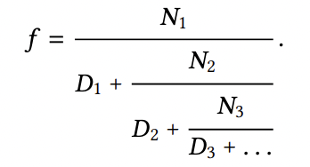
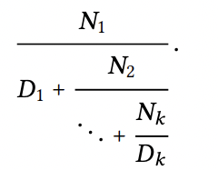

# Exercise 1.37

a. An infinite continued fraction is an expression of the form

<p align="center">
  
</p>

As an example, one can show that the infinite continued fraction expansion with the `Nᵢ` and the `Dᵢ` all equal to `1` produces `1/ϕ`, where `ϕ` is the golden ratio (described in Section 1.2.2). One way to approximate an infinite continued fraction is to truncate the expansion after a given number of terms. Such a truncation — a so-called k-term finite continued fraction—has the form

<p align="center">
  
</p>

Suppose that `n` and `d` are procedures of one argument (the term index `i`) that return the `Nᵢ` and `Dᵢ` of the terms of the continued fraction. Define a procedure `cont-frac` such that evaluating `(cont-frac n d k)` computes the value of the `k-term` finite continued fraction. Check your procedure by approximating `1/ϕ` using 

```scheme
(cont-frac (lambda (i) 1.0)
           (lambda (i) 1.0)
           k)
```

for successive values of `k`. How large must you make `k` in order to get an approximation that is accurate to 4 decimal places?

b. If your cont-frac procedure generates a recursive process, write one that generates an iterative process. If it generates an iterative process, write one that generates a recursive process.

# Solution

|   k   |      result       |
|:-----:|:-----------------:|
|   4   | 0.6000000000000001|
|   5   | 0.625             |
|   6   | 0.6153846153846154|
|   7   | 0.6190476190476191|
|   8   | 0.6176470588235294|
|   9   | 0.6181818181818182|
|  10   | 0.6179775280898876|
|  11   | 0.6180555555555556|
