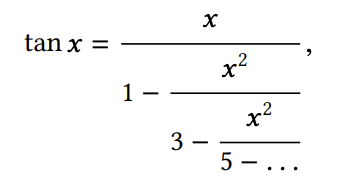

# Exercise 1.39

A continued fraction representation of the tangent function was published in 1770 by the German mathematician J.H. Lambert:

  

where `x` is in radians. Define a procedure `(tan-cf x k)` that computes an approximation to the tangent function based on Lambert’s formula. `k` specifies the number of terms to compute, as in Exercise 1.37.