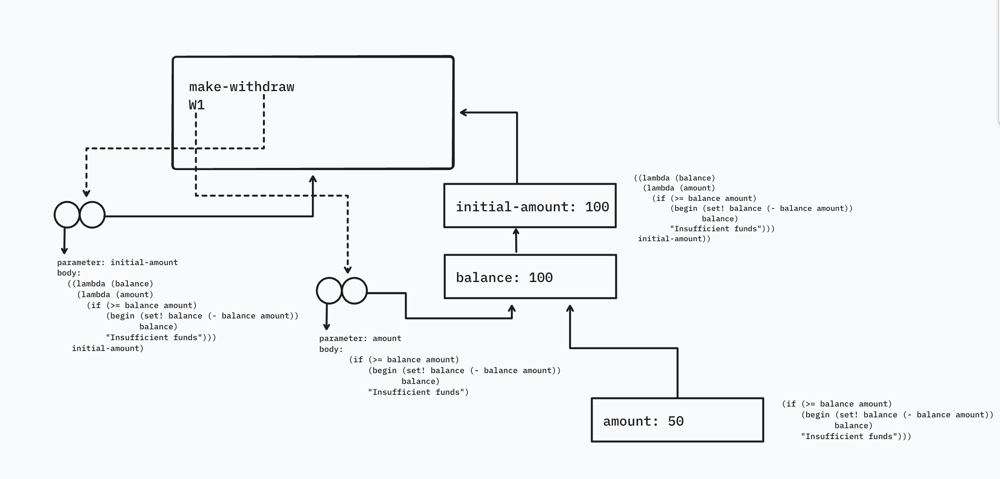

In the `make-withdraw` procedure, the local variable `balance` is created as a parameter of `make-withdraw`. We could also create the local state variable explicitly, using `let`, as follows:

```racket
(define (make-withdraw initial-amount)
  (let ((balance initial-amount))
    (lambda (amount)
      (if (>= balance amount)
          (begin (set! balance (- balance amount))
                 balance)
          "Insufficient funds"))))
```

Recall from Section 1.3.2 that `let` is simply syntactic sugar for a procedure call:

```racket
(let ((⟨var⟩ ⟨exp⟩)) ⟨body⟩)
```

is interpreted as an alternate syntax for

```racket
((lambda (⟨var⟩) ⟨body⟩) ⟨exp⟩)
```

Use the environment model to analyze this alternate version of `make-withdraw`, drawing figures like the ones above to illustrate the interactions

```racket
(define W1 (make-withdraw 100))
(W1 50)
(define W2 (make-withdraw 100))
```

Show that the two versions of `make-withdraw` create objects with the same behavior. How do the environment structures differ for the two versions?

## Solution

For the sake of brevity, I've drawn a figure only to illustrate the interactions of creating an account `W1` and withdrawing 50 from it.



The `make-withdraw` procedure with the `let` expression effectively looks like this:

```racket
(define (make-withdraw initial-amount)
  ((lambda (balance)
    (lambda (amount)
      (if (>= balance amount)
          (begin (set! balance (- balance amount))
                 balance)
          "Insufficient funds")))
   initial-amount))
```

1. When the `make-withdraw` procedure is evaluated, it creates a binding in the global frame for `make-withdraw` to a procedure object that points to the global environment.
2. When we evaluate `(make-withdraw 100)`, we first create a new environment with a frame that binds that parameter `initial-amount` to 100. Then, we evaluate the body of `make-withdraw` – the `let` expression.
3. The application of the outer `lambda` creates another environment, in which we bind `balance` to the value associated with `initial-amount`. Evaluating the `let` creates a procedure object which is bound to `W1` in the global environment.
4. When we call `(W1 50)`, we create a new environment and a frame in which the parameter `amount` is bound to 50. Once the procedure terminates, this frame is no longer pointed to by other parts of the environment.
5. When we create `W2` it constructs a separate sequence of frames which has the same structure as the frames created in steps 2 and 3, which is the environment that this procedure object will point to.

The environment with the frame for `balance` becomes the place where the local state is stored. This behaviour is identical to the previous version of `make-withdraw`. The only difference is that in the sequence of frames, we first have to create an environment with a frame in which `initial-amount` is bound to a value (because we have to evaluate the `let` expression). In the original version, the frame created by applying `make-withdraw` binds `balance` directly, and the returned procedure points to that frame. In the `let` version, the returned procedure points to a `balance` frame whose enclosing environment is the separate `initial-amount` frame.

**Note:** The figure I created shows the point right before applying the `set!`. Once it's applied, the value for `balance` is updated to 50.
