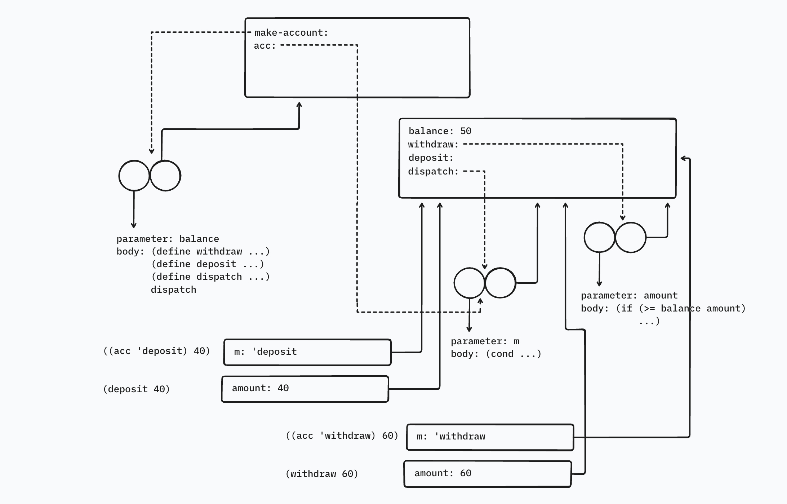

In Section 3.2.3 we saw how the environment model described the behavior of procedures with local state. Now we have seen how internal definitions work. A typical message-passing procedure contains both of these aspects. Consider the bank account procedure of Section 3.1.1:

```racket
(define (make-account balance)
  (define (withdraw amount)
    (if (>= balance amount)
        (begin (set! balance (- balance amount))
               balance)
        "Insufficient funds"))
  (define (deposit amount)
    (set! balance (+ balance amount))
    balance)
  (define (dispatch m)
    (cond ((eq? m 'withdraw) withdraw)
          ((eq? m 'deposit) deposit)
          (else
           (error "Unknown request: MAKE-ACCOUNT"
                  m))))
  dispatch)
```

Show the environment structure generated by the sequence of interactions

```racket
(define acc (make-account 50))
((acc 'deposit) 40)
90
((acc 'withdraw) 60)
30
```

Where is the local state for `acc` kept? Suppose we define another account

```racket
(define acc2 (make-account 100))
```

How are the local states for the two accounts kept distinct? Which parts of the environment structure are shared between `acc` and `acc2`?

## Solution

The environment structure for the series of interactions would look like this:



**Note:** This structure is slightly inaccurate. It shows the frames created from calling `((acc 'deposit) 40)` and `((acc 'withdraw) 60)` simultaneously. In reality, once one of these calls terminates, the frames are irrelevant because there's nothing pointing to them. The value of `balance` after these calls would also be different (30). In the model above, we see the initial value.

When we call `((acc 'deposit) 40)`, upon evaluation, `(acc 'deposit)` gives us the `deposit` procedure and a new frame is created when the `deposit` procedure is applied.

The local state for `acc`, i.e. the value for `balance` and the procedure objects to manipulate it, are kept in the frame associated with the environment created from the call to `make-account`.

If we define a new account, `acc2`, a new environment is created for the other call to `make-account`. Thus, `acc2` will have its own state, and its own binding for `balance`.

The parts of the environment structure shared by `acc` and `acc2` are:

- the global environment
- the procedure object that represents `make-account`

**Note:** The internal procedures have the same code, but they point to different environments, i.e., the separate environments created by the individual calls to `make-account`. So, they're different procedure objects, and aren't shared by `acc` and `acc2`.
