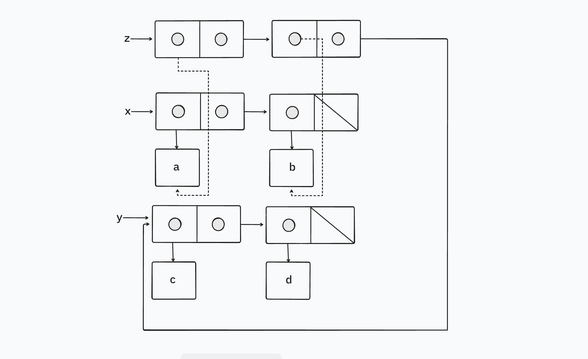
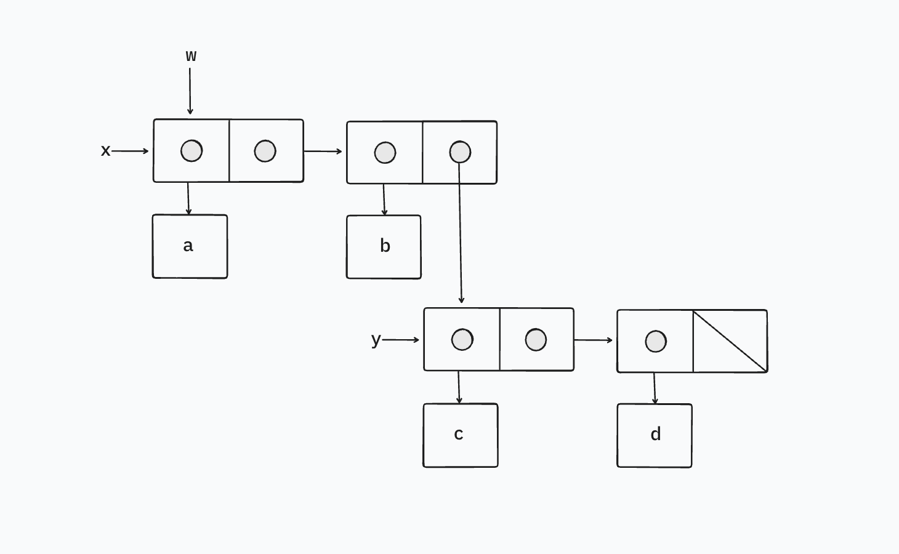

The following procedure for appending lists was introduced in Section 2.2.1:

```racket
(define (append x y)
  (if (null? x)
      y
      (cons (car x) (append (cdr x) y))))
```

`append` forms a new list by successively `cons`ing the elements of `x` onto `y`. The procedure `append!` is similar to
`append`, but it is a mutator rather than a constructor. It appends the lists by splicing them together, modifying the final pair of `x` so that its `cdr` is now `y`. (It is an error to call `append!` with an empty `x`.)

```racket
(define (append! x y)
  (set-cdr! (last-pair x) y)
  x)
```

Here `last-pair` is a procedure that returns the last pair in its argument:

```racket
(define (last-pair x)
  (if (null? (cdr x)) x (last-pair (cdr x))))
```

Consider the interaction

```racket
(define x (list 'a 'b))
(define y (list 'c 'd))
(define z (append x y))
z
(a b c d)
(cdr x)
⟨response⟩
(define w (append! x y))
w
(a b c d)
(cdr x)
⟨response⟩
```

What are the missing *⟨response⟩*s? Draw box-and-pointer diagrams to explain your answer.

## Solution

```racket
(define x (list 'a 'b))
(define y (list 'c 'd))
(define z (append x y))
z
(a b c d)
(cdr x)
(b)
(define w (append! x y))
w
(a b c d)
(cdr x)
(b c d)
```

This is what `x`, `y`, and `z` look like after `z` is defined, i.e. the `append` is performed.



This is what `x`, `y`, and `w` look like after `w` is defined, i.e. the `append!` is performed.


