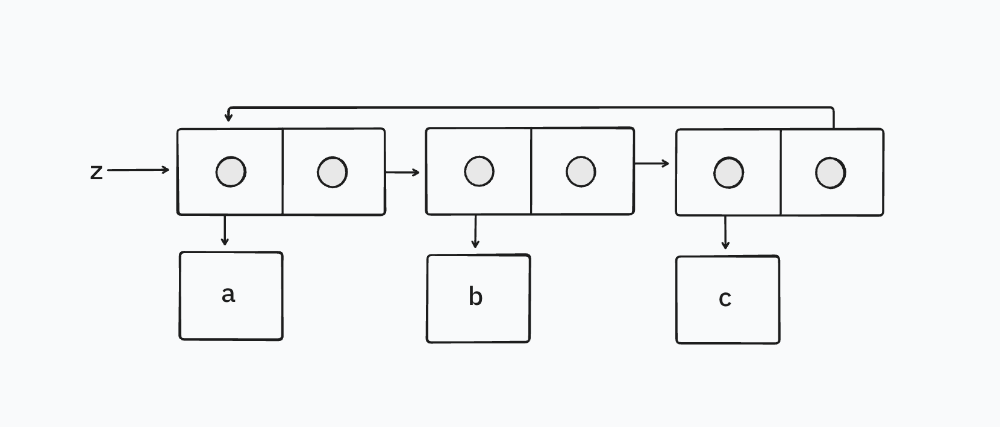

Consider the following `make-cycle` procedure, which uses the `last-pair` procedure defined in [Exercise 3.12](/exercise-3-12):

```racket
(define (make-cycle x)
  (set-cdr! (last-pair x) x)
  x)
```

Draw a box-and-pointer diagram that shows the structure `z` created by

```racket
(define z (make-cycle (list 'a 'b 'c)))
```

What happens if we try to compute `(last-pair z)`?

## Solution

We end up with an infinite loop because the `cdr` of the last pair in the list points to the first pair in the list. So, during the evaluation of `(last-pair z)`, we never satisfy the terminating condition, i.e. that we've reached the last pair of the list, which is signalled by a pair whose second value is `nil`.


