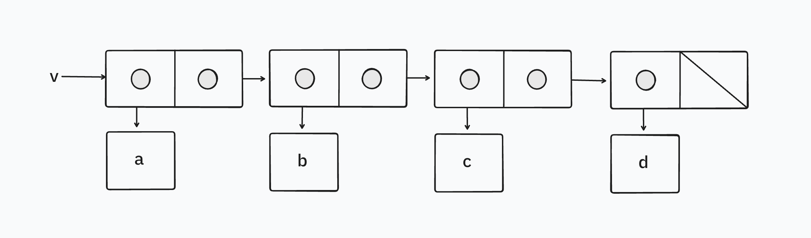
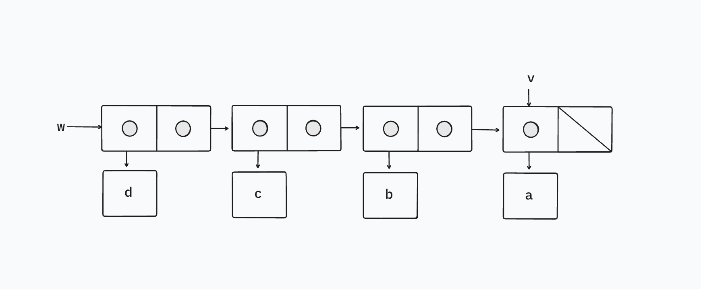

The following procedure is quite useful, although obscure:

```racket
(define (mystery x)
  (define (loop x y)
    (if (null? x)
        y
        (let ((temp (cdr x)))
          (set-cdr! x y)
          (loop temp x))))
  (loop x '()))
```

`loop` uses the “temporary” variable `temp` to hold the old value of the `cdr` of `x`, since the `set-cdr!` on the next line destroys the `cdr`. Explain what `mystery` does in general. Suppose `v` is defined by `(define v (list 'a 'b 'c
'd))`. Draw the box-and-pointer diagram that represents the list to which `v` is bound. Suppose that we now evaluate `(define w (mystery v))`. Draw box-and-pointer diagrams that show the structures `v` and `w` after evaluating this expression. What would be printed as the values of `v` and `w`?

## Solution

`mystery` takes a list structure and reverses it. In `loop`, during each iteration, the first pair of the remaining list is shaved off and made to point to the new accumulated reversed list and we continue with the old rest of the list (the `cdr` we store in `temp`). When we're done iterating, we return the result.

One reason for the obscureness is the ambiguity of the names of the procedure `mystery` and the internal procedure `loop` – these names don't convey what these procedures do and it left me confused. Writing down the state of `x` and `y` after each iteration helped me gain clarity. 

```racket
(loop '(a b c d) '())
(loop '(b c d) '(a))
(loop '(c d) '(b a))
(loop '(d) '(c b a))
(loop '() '(d c b a))
```

This is the box-and-pointer diagram of the list to which `v` is bound before we perform the `mystery` operation.



After evaluating `(define w (mystery v))`, the value of `v` would be printed as `(a)` and the value of `w` would be printed as `(d c b a)`. This is a side-effect of using the assignment `set-cdr!` in `loop`. When we call `(mystery v)`, `v`'s value is bound to the parameter `x` in the environment created by `loop`. Then, its `cdr` is set to an empty list when `set-cdr!` is called – since `v` still points to the original first pair, and that pair’s `cdr` is set to `'()` during the first iteration, `v` now prints as `(a)`. Remember, `set-cdr!` modifies the same pair. So, `x` and `v` will still point to this modified pair. In the next iteration of `loop`, this modified `x` is passed as the argument for `y`. So, this pair is never modified again.

This is the box-and-pointer diagram of the lists to which `v` and `w` are bound after we perform the `mystery` operation.


