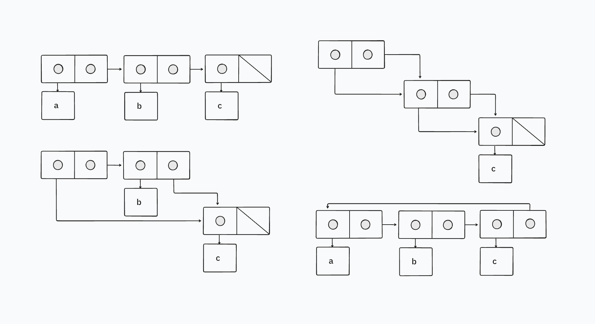

Ben Bitdiddle decides to write a procedure to count the number of pairs in any list structure. “It’s easy,” he reasons. “The number of pairs in any structure is the number in the `car` plus the number in the `cdr` plus one more to count the current pair.” So Ben writes the following procedure:

```racket
(define (count-pairs x)
  (if (not (pair? x))
      0
      (+ (count-pairs (car x))
         (count-pairs (cdr x))
         1)))
```

Show that this procedure is not correct. In particular, draw box-and-pointer diagrams representing list structures made up of exactly three pairs for which Ben’s procedure would return 3; return 4; return 7; never return at all.

## Solution

We can use `set-car!` and `set-cdr!` to change the pointers of the pairs to point to one of the three pairs such that there are only 3 pairs in existence, but a greater number of pointers to these pairs.

To get:

- 3 pairs, you'd just call `count-pairs` on the list as is
- 4 pairs, you `set-car!` of the first pair to be the last pair, before calling `count-pairs`.
- 7 pairs, you `set-car!` of the second pair to be the last pair, and you `set-car!` of the first pair to point to the second pair as well.
- an infinite loop, we create a cycle structure, i.e. make the `cdr` of the last pair point to the first pair.


