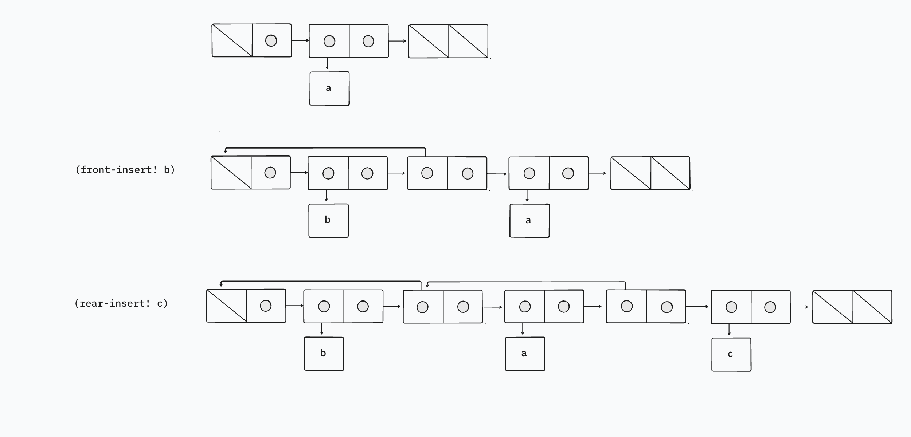

A *deque* (“double-ended queue”) is a sequence in which items can be inserted and deleted at either the front or the rear. Operations on deques are the constructor `make-deque`, the predicate `empty-deque?`, selectors `front-deque` and `rear-deque`, mutators `front-insert-deque!`, `rear-insert-deque!`, `front-delete-deque!`, and `rear-delete-deque!`. Show how to represent deques using pairs, and give implementations of the operations. All operations should be accomplished in Θ(1) steps.

## Solution

I'm a bit embarrassed to admit that this problem left me stumped. I think I was on the right train of thought, but I had to look it up and I ended up receiving some assistance before arriving at the final realization. 

Most of these operations are straightforward to implement in Θ(1) steps, except for `rear-delete-deque!`. When you pop an item from the rear end of the queue, you need to update the rear end pointer to the penultimate item and then `set-cdr!` to `null` so that the last item is removed from the queue.

How do you find the penultimate item, though? We could successively `cdr` through the underlying list, but then, the order of growth of steps would be Θ(*n*). What if we maintain a pointer to the penultimate item? Great, now the first rear-delete can be performed in Θ(1) steps. But what about the next one? How would we update the next penultimate pointer without scanning through the entire list? Sure, you could maintain a pair of penultimate pointers. But, that just means you'd run into the same problem after 2 deletions. This is where I started drawing blanks and I'm so annoyed that I didn't draw this conclusion on my own (because I was so close and just got curious about whether I was heading in the right direction). Every item in the deque should maintain information about the next and previous items!

We do this by creating a structure – let's call it a node. It's a list with 3 items in it. The first pair points to the previous node. The second pair gives us the item. And the third pair points to the next node in the deque. Whenever we perform a mutation, we update the pointers to the next and previous nodes accordingly.

Initially, I tried wrapping each node so that the `car` of each pair points to the node, and the `cdr` points to the next wrapper. This convolutes the structure of the data and the program. To maintain clarity about how the structure would look, here's a diagram.

The reason we don't get thrown in an infinite loop like in Exercise 3.13 is that the cycle happens in the `car` of certain pairs and not in the `cdr`. So, when we successively `cdr` through the list, we don't end up at the beginning of a list.
