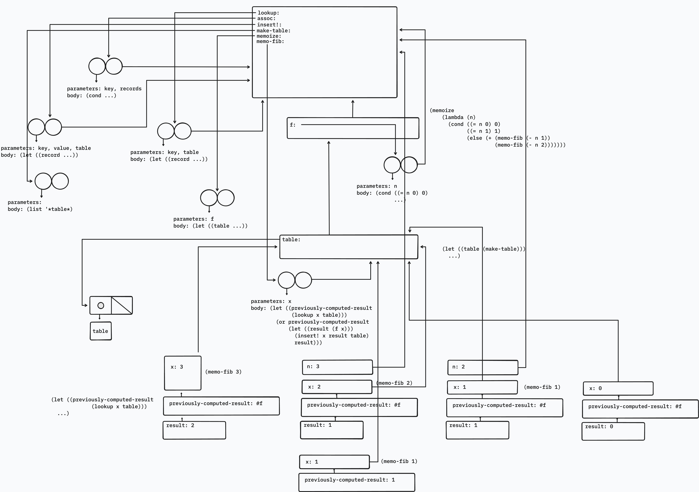

*Memoization* (also called *tabulation*) is a technique that enables a procedure to record, in a local table, values that have previously been computed. This technique can make a vast difference in the performance of a program. A memoized procedure maintains a table in which values of previous calls are stored using as keys the arguments that produced the values. When the memoized procedure is asked to compute a value, it first checks the table to see if the value is already there and, if so, just returns that value. Otherwise, it computes the new value in the ordinary way and stores this in the table. As an example of memoization, recall from Section 1.2.2 the exponential process for computing Fibonacci numbers:

```racket
(define (fib n)
  (cond ((= n 0) 0)
        ((= n 1) 1)
        (else (+ (fib (- n 1)) (fib (- n 2))))))
```

The memoized version of the same procedure is

```racket
(define memo-fib
  (memoize
    (lambda (n)
      (cond ((= n 0) 0)
            ((= n 1) 1)
            (else (+ (memo-fib (- n 1))
                     (memo-fib (- n 2))))))))
```

where the memoizer is defined as

```racket
(define (memoize f)
  (let ((table (make-table)))
    (lambda (x)
      (let ((previously-computed-result
             (lookup x table)))
        (or previously-computed-result
            (let ((result (f x)))
              (insert! x result table)
              result))))))
```

Draw an environment diagram to analyze the computation of `(memo-fib 3)`. Explain why `memo-fib` computes the *n*th Fibonacci number in a number of steps proportional to *n*. Would the scheme still work if we had simply defined `memo-fib` to be `(memoize fib)`?

## Solution

> Draw an environment diagram to analyze the computation of `(memo-fib 3)`.



> Explain why `memo-fib` computes the *n*th Fibonacci number in a number of steps proportional to *n*.

**Note:** The diagram has been simplified for the sake of brevity:

- Environments for calls to `lookup`, `insert!`, and `assoc` have been omitted.
- The table structure doesn't show the full list of memoized records for the computation of `(memo-fib 3)`.
- For both the first `(memo-fib 1)` and `(memo-fib 0)`, `lookup` misses. So, the result is computed by calling the callback `f`. The `n: 1` and `n: 0` frames respectively are missing.

Shown below is the expansion caused by the evaluation of the expression `(memo-fib 3)`.

```racket
(memo-fib 3)

(+ (memo-fib 2)
   (memo-fib 1))

(+ (+ (memo-fib 1)
      (memo-fib 0))
   (memo-fib 1))

(+ (+ 1 0)
   (memo-fib 1))

(+ 1 1)

2
```

The first operand is evaluated at each step, until we reach the terminal cases of `n = 0` and `n = 1`. In the process, the values of `(fib 2)`, `(fib 1)`, and `(fib 0)` are memoized. So, when the second `(memo-fib 1)` call is evaluated, the value is simply looked up in the table. Finally, once `(memo-fib 3)` is evaluated, the value of `(fib 3)` is also added to the table.

In this example, the distinct computations are:

```
3, 2, 1, 0
```

The recursive calls descend until they reach the base cases `(memo-fib 1)` and `(memo-fib 0)`. These are the first calls whose results can be returned directly, and those results are inserted into the table. From there, the pending calls for `(memo-fib 2)`, `(memo-fib 3)`, and so on can complete using already computed smaller values. When we start evaluating the right branches, instead of performing redundant computations with recursive calls, we simply will look up the values, since we have already computed them. This eliminates the work previously required by descending into branches in recursive calls. Thus the number of real applications of the Fibonacci procedure (the lambda expression we pass as a parameter `f` in `memoize`) is proportional to `n`.

**Note:** This assumes that table lookup and insertion are treated as constant-time operations. If the table is implemented as a simple association list, then each lookup may take time proportional to the size of the table, making the total cost closer to quadratic.

> Would the scheme still work if we had simply defined `memo-fib` to be `(memoize fib)`?

This scheme wouldn't have worked if we had simply defined `memo-fib` to be `(memoize fib)` because the recursive calls would be to `fib` and not `memo-fib`. This means that only the outermost call gets memoized, and the recursive subproblems aren't.
