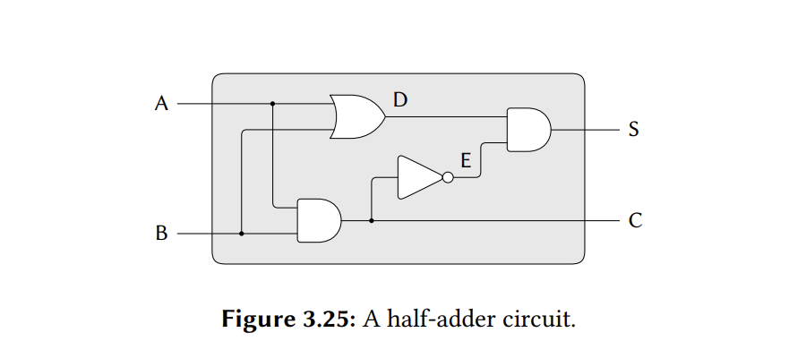

The internal procedure `accept-action-procedure!` defined in `make-wire` specifies that when a new action procedure is added to a wire, the procedure is immediately run. Explain why this initialization is necessary. In particular, trace through the half-adder example in the paragraphs above and say how the system’s response would differ if we had defined `accept-action-procedure!` as

```racket
(define (accept-action-procedure! proc)
  (set! action-procedures
        (cons proc action-procedures)))
```

## Solution

Technically, when a connection is established between a digital component and a wire, it is equivalent to a change in the input signal's value, and we want the output signal to respond to it accordingly. If the output wire has an incorrect signal on initialization, there's a risk of it continuing to transmit an incorrect signal even when the input signal changes. To illustrate this, let's take a look at the half-adder example.



- The external input wires, A and B, 
- the external output wires, S and C,
- and the internal wires, D and E

all have an initial signal value of 0.

Let's say that we connect them to the respective primitive digital circuit components without  calling the action procedure as soon as it's installed for that wire. Now, the signal values of all of the wires will remain the same, i.e. 0. This is okay for the outputs of D and C, since it's the expected behaviour. But, in the case of E, the inverter should flip the input signal from 0 to 1. This doesn't happen.

Now, let's say we change the signal value of A to 1. The action procedure for the and-gate runs. But, the output signal at C remains 0. Since the input signal to the inverter doesn't change, the action procedure for it doesn't run, and the output signal remains unchanged. This means that the signal value at S is 0. But, for a half-adder, if only one of the input signals is 1, the signal at S should also be 1.

The half-adder doesn't behave as intended because the action procedures aren't run as soon as they're installed.
