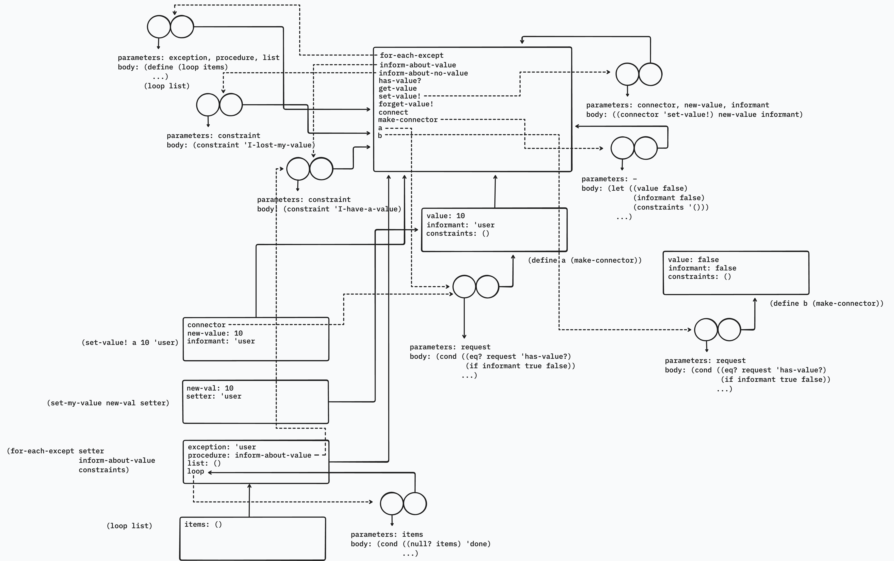

Suppose we evaluate the following sequence of expressions in the global environment:

```racket
(define a (make-connector))
(define b (make-connector))
(set-value! a 10 'user)
```

At some time during evaluation of the `set-value!`, the following expression from the connector’s local procedure is evaluated:

```racket
(for-each-except
  setter inform-about-value constraints)
```

Draw an environment diagram showing the environment in which the above expression is evaluated.

## Solution

**Note:** The environment diagram shows the state after the call to `for-each-except` has begun, not after it has been evaluated.


