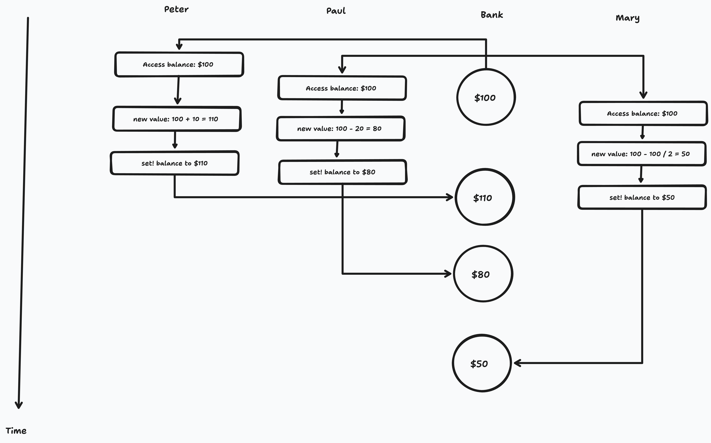

Suppose that Peter, Paul, and Mary share a joint bank account that initially contains $100. Concurrently, Peter deposits $10, Paul withdraws $20, and Mary withdraws half the money in the account, by executing the following commands:

```
Peter: (set! balance (+ balance 10))
Paul: (set! balance (- balance 20))
Mary: (set! balance (- balance (/ balance 2)))
```

a. List all the different possible values for `balance` after these three transactions have been completed, assuming that the banking system forces the three processes to run sequentially in some order.
b. What are some other values that could be produced if the system allows the processes to be interleaved? Draw timing diagrams like the one in Figure 3.29 to explain how these values can occur.

## Solution

If the banking system forces the processes to run sequentially, these are the possible orderings:

- 110 → 90 → 45
- 110 → 55 → 35
- 80 → 90 → 45
- 80 → 40 → 50
- 50 → 60 → 40
- 50 → 30 → 40

The distinct values that are possible are: 45, 35, 50, and 40.

If the system allows interleaving, the following orderings are also possible:

- 110 -> 80 -> 50
- 80 -> 50 -> 110
- 50 -> 110 -> 80
- 110 -> 55 -> 90
- 110 -> 90 -> 55
- 80 -> 90 -> 40
- 80 -> 40 -> 90
- 50 -> 30 -> 60
- 50 -> 60 -> 30

So, some of the other possible values are: 110, 80, 90, 55, 60, and 30.

Here's a timing diagram for the first ordering listed if interleaving is allowed; it depicts the scenario for when all the accesses give the same value and Mary's `set!` is processed last.


