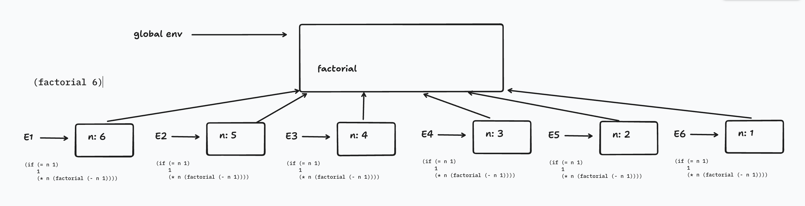
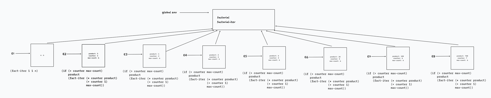

In Section 1.2.1 we used the substitution model to analyze two procedures for computing factorials, a recursive version

```racket
(define (factorial n)
  (if (= n 1) 
      1 
      (* n (factorial (- n 1)))))
```

and an iterative version

```racket
(define (factorial n) (fact-iter 1 1 n))
(define (fact-iter product counter max-count)
  (if (> counter max-count)
      product
      (fact-iter (* counter product)
                 (+ counter 1)
                 max-count)))
```

Show the environment structures created by evaluating `(factorial 6)` using each version of the `factorial` procedure.

## Solution

The environment model of evaluation:

- Each environment consists of a sequence of frames.
- Each frame is a table of bindings, i.e. variables and their corresponding values.
- When a procedure definition is evaluated, the result yields a procedure object, i.e. a pair of values. The first value has information about the procedure, i.e. the formal parameters and the code of the procedure's body. The second value is a pointer to the enclosing environment, i.e. the place where the procedure definition was evaluated.
- When a combination is evaluated, each sub-expression is evaluated. Then, the value of the operator sub-expression is applied to the values of the operand sub-expressions. Unlike the substitution model, variables are resolved by looking them up in the current environment.
- The operator sub-expression evaluates to the procedure object.
- When the procedure object is applied to the operands, a new environment is created, along with a corresponding frame. Within this frame, we bind the formal parameters to the argument values, i.e. operands.
- Then, we evaluate the body of the procedure.

In the recursive version, `(factorial 6)` applies the procedure object associated with `factorial` in the global environment to 6. A new frame is created where the formal parameter `n` is bound to 6, and the body of the procedure is evaluated in that environment.

```racket
(if (= 6 1) 
    1 
    (* 6 (factorial (- 6 1))))
```

When `(* 6 (factorial (- 6 1))))` is evaluated, we search for a binding for `factorial` within the frame attached to the environment created by `(factorial 6)`. Since it doesn't exist, we check in the next frame in the sequence, which is the global frame. Then, we apply this procedure object to the argument, which is the result of evaluating `(- 6 1)`, i.e. 5. This keeps going on until we hit `n = 1`.

At that point, the recursive calls begin returning values to the pending multiplications in the earlier environments:

```racket
(* 2 1)
(* 3 2)
(* 4 6)
(* 5 24)
(* 6 120)
```

So, in the recursive version, each environment has a deferred multiplication waiting for the result of the next recursive call.



In the iterative version, an environment and a frame is created for `(factorial 6)`. The body is evaluated with 6 bound to `n`.

```racket
(fact-iter 1 1 6)
```

When evaluating `(fact-iter 1 1 6)`, we look for a binding for `fact-iter` in the current environment for `(factorial 6)`. Since a binding doesn't exist, we move on to the global frame. We apply the procedure object to the arguments, binding the values 1, 1, and 6 to the formal parameters `product`, `counter`, and `max-count` in the frame for the new environment created for `(fact-iter 1 1 6)`. Then, we evaluate the body in the new environment where the formal parameters are bound to the argument values.

```racket
(if (> 1 6)
    1
    (fact-iter (* 1 1)
               (+ 1 1)
               6))
```

So, we call `fact-iter` again, with the values for `product`, `counter`, and `max-count` updated to values for the next iteration. This goes on until we hit `counter = 7`. At this point, the result 720 is returned.

Unlike the recursive version, there are no pending multiplications waiting to be performed. Each call to `fact-iter` contains the complete state of the computation in its arguments: `product`, `counter`, and `max-count`.


